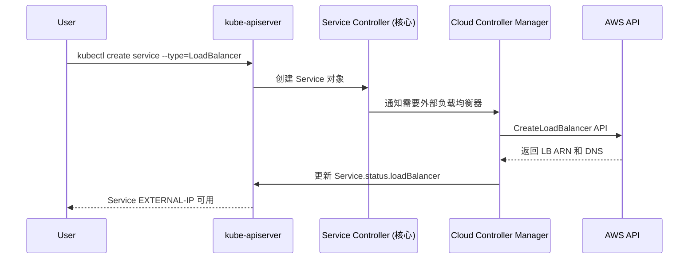
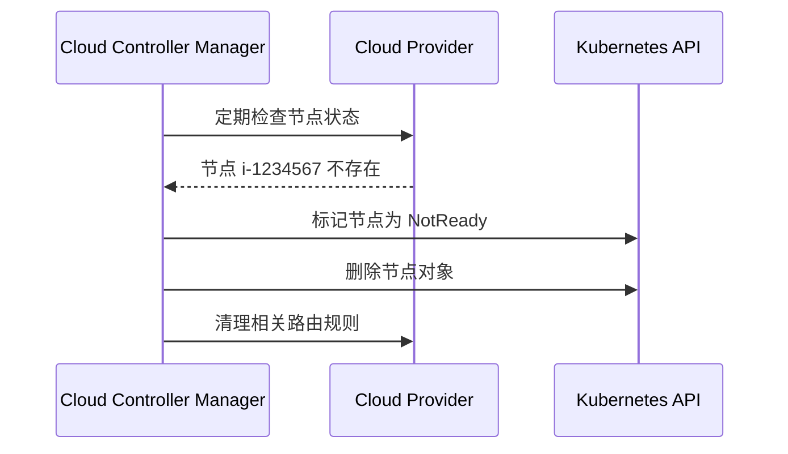

# Cloud Controller Manager (CCM) 详解

## 🎯 CCM 的核心作用

### ❌ 常见误解
```
cloud-controller-manager ≠ 对外暴露集群
cloud-controller-manager ≠ 集群网关
cloud-controller-manager ≠ Ingress Controller
```

### ✅ 真实作用：云基础设施自动化管理

## 🏗️ 四大核心控制器

### 1. 🖥️ Node Controller（节点控制器）
```yaml
职责:
  - 检测云节点的生命周期状态
  - 当云虚拟机被删除时，自动从集群中移除对应的 Node
  - 为节点添加云特定的标签和注解
  - 获取节点的云元数据（可用区、实例类型等）

实际场景:
  AWS EC2 实例被终止 → CCM 检测到 → 自动删除 Kubernetes Node
```

**示例：**
```bash
# 云节点被删除前
kubectl get nodes
NAME                STATUS   ROLES    AGE   VERSION
ip-10-0-1-100.ec2   Ready    <none>   1d    v1.27.3
ip-10-0-1-101.ec2   Ready    <none>   1d    v1.27.3

# AWS EC2 实例 ip-10-0-1-101 被终止
# CCM Node Controller 自动检测并清理

# 几分钟后
kubectl get nodes
NAME                STATUS     ROLES    AGE   VERSION
ip-10-0-1-100.ec2   Ready      <none>   1d    v1.27.3
ip-10-0-1-101.ec2   NotReady   <none>   1d    v1.27.3  # 自动标记为 NotReady
# 最终自动删除
```

### 2. 🛣️ Route Controller（路由控制器）
```yaml
职责:
  - 在云网络中配置 Pod 网络路由
  - 确保不同节点上的 Pod 可以相互通信
  - 管理云 VPC 路由表

实际场景:
  新节点加入集群 → CCM 在 VPC 路由表中添加该节点的 Pod CIDR 路由
```

**示例：**
```bash
# AWS VPC 路由表自动配置
目标 CIDR        下一跳
10.244.1.0/24   → eni-abc123 (node1 网卡)
10.244.2.0/24   → eni-def456 (node2 网卡)
10.244.3.0/24   → eni-ghi789 (node3 网卡)
```

### 3. ⚖️ Service Controller（服务控制器）
```yaml
职责:
  - 为 LoadBalancer 类型的 Service 创建云负载均衡器
  - 管理负载均衡器的生命周期
  - 配置负载均衡器的监听器和目标组

实际场景:
  创建 LoadBalancer Service → CCM 调用云 API 创建 ELB/ALB/NLB
```

**示例：**
```yaml
# Kubernetes Service
apiVersion: v1
kind: Service
metadata:
  name: my-app
spec:
  type: LoadBalancer
  ports:
  - port: 80
    targetPort: 8080
  selector:
    app: my-app

# CCM Service Controller 自动执行：
# 1. 调用 AWS ELB API 创建负载均衡器
# 2. 配置监听端口 80
# 3. 添加后端目标（节点的 NodePort）
# 4. 更新 Service 的 EXTERNAL-IP
```

### 4. 💾 Volume Controller（存储控制器）
```yaml
职责:
  - 管理云存储卷的挂载和卸载
  - 处理 PersistentVolume 的动态预配
  - 协调存储卷在不同节点间的迁移

实际场景:
  Pod 调度到新节点 → CCM 将 EBS 卷从旧节点分离并挂载到新节点
```

## 🔄 工作流程示例

### 场景1：创建 LoadBalancer Service



### 场景2：节点故障处理



## 🚀 实际部署架构

### AWS EKS 环境：
```yaml
# CCM 作为 DaemonSet 或 Deployment 运行
apiVersion: apps/v1
kind: Deployment
metadata:
  name: cloud-controller-manager
  namespace: kube-system
spec:
  template:
    spec:
      containers:
      - name: cloud-controller-manager
        image: k8s.gcr.io/provider-aws/cloud-controller-manager:v1.27.0
        command:
        - /bin/aws-cloud-controller-manager
        - --cloud-provider=aws
        - --leader-elect=true
        - --configure-cloud-routes=false  # VPC CNI 负责路由
        - --cluster-name=my-eks-cluster
        env:
        - name: AWS_REGION
          value: us-west-2
```

## 📊 对外暴露集群的正确方式

### CCM 不负责对外暴露，真正负责的是：

1. **LoadBalancer Service + CCM**：
   ```bash
   CCM 创建云 LB → 外部流量进入集群
   ```

2. **Ingress Controller**：
   ```bash
   nginx-ingress/traefik → 7层负载均衡 → 域名路由
   ```

3. **NodePort Service**：
   ```bash
   直接通过节点 IP:Port 访问
   ```

4. **ExternalName Service**：
   ```bash
   DNS CNAME 重定向
   ```

## 🎯 总结

**Cloud Controller Manager 的本质**：
- 🔗 **桥梁作用**：连接 Kubernetes 抽象资源与云基础设施
- 🤖 **自动化管理**：无需人工干预的云资源生命周期管理  
- 🏗️ **基础设施即代码**：通过 Kubernetes API 声明式管理云资源
- 🔄 **状态同步**：保持 K8s 集群状态与云环境的一致性

**不是**：
- ❌ 集群网关或代理
- ❌ 直接的流量入口
- ❌ 服务发现机制
- ❌ 对外 API 接口